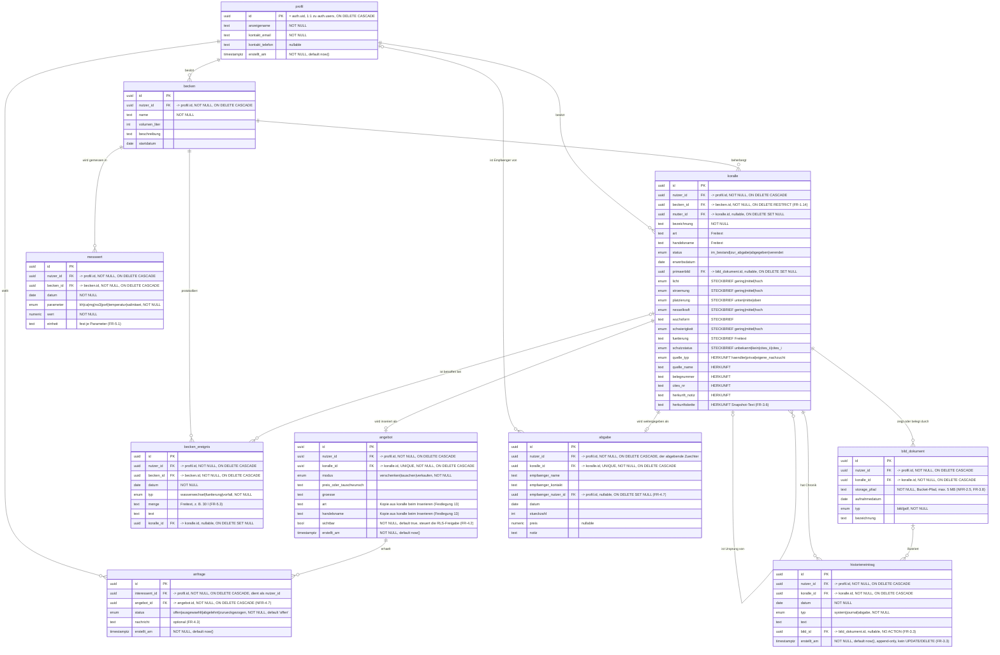
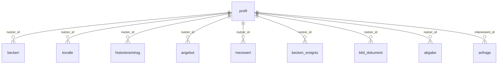

# Coralkeeper – ER-Modell

**Version 1.0** · Stand: 09.09.2026
**Grundlage:** `Coralkeeper-Requirements-v2.2.md`, Abschnitt 4 (Kernentitäten), Abschnitt 3 (Grundsatzentscheidungen), NFR-4.7.

Dieses Dokument ist die Übersetzung von Abschnitt 4 in ein konkretes Datenmodell. Es fügt nichts fachlich Neues hinzu; alle Festlegungen sind aus den Anforderungen abgeleitet und in Abschnitt 3 dieses Dokuments einzeln begründet.

---

## 1. Fachliches ER-Diagramm

Die Entitäten des MVP-Umfangs aus 1.1 der Anforderungen sind `profil`, `becken`, `koralle`, `historieneintrag`, `angebot`, `messwert` und `becken_ereignis` – der Steckbrief ist nach 4.1 in `koralle` eingebettet.

> **Lesehinweis:** Jede fachliche Tabelle trägt nach 4.2 der Anforderungen eine Spalte `nutzer_id` → `profil.id`. Diese Kanten sind hier aus Gründen der Lesbarkeit **nicht** eingezeichnet – sie stehen als Attribut in jeder Entität und sind in Abschnitt 2 als eigenes Diagramm dargestellt.

---

## 2. Eigentümerschaft (Grundlage der RLS)

Nach 4.2 der Anforderungen trägt jede fachliche Tabelle eine eigene `nutzer_id`. Jede RLS-Policy bleibt damit einzeilig: `nutzer_id = auth.uid()`.

**Zwei Ausnahmen von der strikten Trennung** (FR-6.2):

| Ausnahme              | Regel                                                                                                                                                                                | Anforderung     |
| --------------------- | ------------------------------------------------------------------------------------------------------------------------------------------------------------------------------------ | --------------- |
| Sichtbare Inserate    | `angebot` ist für alle angemeldeten Nutzer lesbar, solange `sichtbar = true`. Die angezeigten Korallenfelder stehen als Kopie in `angebot`, `koralle` bleibt privat (Festlegung 13). | FR-4.2          |
| Freigegebene Kontakte | `profil.anzeigename`, `kontakt_email`, `kontakt_telefon` werden für die Gegenseite lesbar, sobald eine `anfrage` den Status `ausgewaehlt` trägt.                                     | FR-4.5, NFR-3.3 |

### RLS-Matrix

„eigene" = `nutzer_id = auth.uid()` · ohne Zusatz = in der Datenbank angelegt (15.09.2026) ·
„ab MS-x" = spätestens in diesem Meilenstein anzulegen · ✘ = bewusst keine Policy.
Alle Policies gelten nur für `authenticated` – nicht angemeldete Nutzer (`anon`) sehen nichts.

| Tabelle            | SELECT                                                                 | INSERT                                                                  | UPDATE                                  | DELETE                               |
| ------------------ | ---------------------------------------------------------------------- | ----------------------------------------------------------------------- | --------------------------------------- | ------------------------------------ |
| `profil`           | `id = auth.uid()` · Kontaktfreigabe ab MS-11 (FR-4.5)                  | ✘ nur per Trigger (Festlegung 14)                                       | `id = auth.uid()` ab MS-9 (FR-6.8)      | ✘ Kontolöschung in Supabase (FR-6.9) |
| `becken`           | eigene                                                                 | eigene                                                                  | eigene ab MS-3 (FR-1.1)                 | eigene ab MS-3 (FR-1.1)              |
| `koralle`          | eigene · ✘ für Fremde (Festlegung 13)                                  | eigene                                                                  | eigene ab MS-3 (FR-2.1, FR-4.1, FR-4.2) | eigene ab MS-9 (FR-1.10)             |
| `historieneintrag` | eigene                                                                 | eigene                                                                  | **✘ FR-3.3 (Festlegung 7)**             | **✘ FR-3.3 (Festlegung 7)**          |
| `angebot`          | eigene **oder `sichtbar = true`** (FR-4.2)                             | eigene · zusätzlich eigene Koralle ab MS-3 (Festlegung 12)              | eigene ab MS-11 (FR-4.4, FR-4.6)        | eigene (FR-4.2)                      |
| `anfrage`          | `interessent_id = auth.uid()` · Züchter des Inserats ab MS-11 (FR-4.4) | `interessent_id = auth.uid()` · nicht eigenes Inserat ab MS-11 (FR-4.3) | ab MS-11, Bedingung dort (FR-4.4, 4.6)  | ab MS-11, Bedingung dort             |
| `messwert`         | eigene                                                                 | eigene                                                                  | eigene (Festlegung 8)                   | eigene (Festlegung 8)                |
| `becken_ereignis`  | eigene                                                                 | eigene                                                                  | eigene (Festlegung 8)                   | eigene (Festlegung 8)                |
| `bild_dokument`    | eigene · Inseratbild für Fremde ab MS-9 (TASK-02-05 D)                 | eigene                                                                  | ✘ keine Anforderung                     | eigene ab MS-9                       |
| `abgabe`           | eigene                                                                 | eigene · zusätzlich eigene Koralle ab MS-3 (Festlegung 12)              | ab MS-10, Bedingung dort                | ab MS-10, Bedingung dort             |

---

## 3. Begründete Festlegungen

| #   | Festlegung                                                                  | Herleitung                                                                                                                                                                                                                                                                                              |
| --- | --------------------------------------------------------------------------- | ------------------------------------------------------------------------------------------------------------------------------------------------------------------------------------------------------------------------------------------------------------------------------------------------------- |
| 1   | `koralle.becken_id` ist `NOT NULL`, Löschregel `RESTRICT`                   | FR-1.14, FR-1.1 (Becken mit Korallen erst löschbar, wenn diese umgesetzt oder gelöscht sind), NFR-4.7                                                                                                                                                                                                   |
| 2   | `koralle.mutter_id` ist nullable, Löschregel `ON DELETE SET NULL`           | FR-1.10 (Ableger bleiben erhalten, der Verweis wird geleert), NFR-4.7                                                                                                                                                                                                                                   |
| 3   | Steckbrief- und Herkunftsfelder liegen als Spalten in `koralle`             | Abschnitt 4.1 der Anforderungen; der Ableger-Snapshot nach FR-1.7/FR-3.6 wird damit ein reines Kopieren von Spalten                                                                                                                                                                                     |
| 4   | `angebot.koralle_id` mit `UNIQUE`                                           | Abschnitt 4: `koralle 0..1 angebot`                                                                                                                                                                                                                                                                     |
| 5   | `abgabe.koralle_id` mit `UNIQUE`                                            | Status `abgegeben` ist Endzustand; eine Koralle wird nur einmal weitergegeben                                                                                                                                                                                                                           |
| 6   | `anfrage.angebot_id` mit `ON DELETE CASCADE`                                | NFR-4.7; das Inserat ist nach Abschnitt 3.8 kurzlebig und wird nach der Abgabe gelöscht                                                                                                                                                                                                                 |
| 7   | `historieneintrag` ohne UPDATE- und DELETE-Policy                           | FR-3.3: append-only. Die Unveränderlichkeit wird in der Datenbank erzwungen, nicht in der UI                                                                                                                                                                                                            |
| 8   | `messwert` und `becken_ereignis` mit UPDATE- und DELETE-Policy              | FR-5.10: Diary-Einträge sind korrigierbar – der bewusste Gegensatz zu Nr. 7                                                                                                                                                                                                                             |
| 9   | `koralle.primaerbild` als FK auf `bild_dokument.id`                         | FR-1.3 (Kachel mit Primärbild), FR-1.12 (mehrere Bilder je Koralle)                                                                                                                                                                                                                                     |
| 10  | Keine Tabellen für Arten, Morphen oder Vorlagen                             | Abschnitt 3.7 und Abschnitt 4 der Anforderungen                                                                                                                                                                                                                                                         |
| 11  | Jede fachliche Tabelle trägt `nutzer_id`; Policies prüfen nur diese Spalte  | Anforderungen 4.2, KISS: einzeilige Policies statt Prüfung über Joins (MS-2, Entscheidung 4)                                                                                                                                                                                                            |
| 12  | Beim Anlegen von `angebot` und `abgabe` muss die Koralle dem Nutzer gehören | Folge aus Nr. 11: Fremdschlüssel werden ohne RLS geprüft. `angebot.koralle_id` ist für Fremde sichtbar und beide Spalten sind `UNIQUE` – ohne Prüfung könnte ein Fremder Inserat oder Abgabe einer fremden Koralle blockieren. Übrige Verweise bleiben ungeprüft, ihre IDs werden Fremden nicht bekannt |
| 13  | `angebot.art` und `angebot.handelsname` als Kopie aus `koralle`             | FR-4.2: RLS wirkt zeilenweise, nicht spaltenweise – Fremde lesen nur `angebot`, `koralle` bleibt privat. `art` für den Filter nach FR-4.3. Spätere Änderungen an der Koralle wirken nicht auf das Inserat; vertretbar, weil Inserate kurzlebig sind (Anforderungen 3.8)                                 |
| 14  | `profil` ohne INSERT-Policy                                                 | FR-6.10: Profile legt allein der Trigger an (`security definer`), das Frontend nie                                                                                                                                                                                                                      |

### Fremdschlüssel und Löschverhalten

Alle 23 Fremdschlüssel mit ihrer Löschregel – was passiert mit dem Datensatz, wenn der Datensatz gelöscht wird, auf den er verweist.
Ohne Angabe gilt `NO ACTION` (Löschen wird abgelehnt). Entschieden in TASK-02-03, in der Datenbank umgesetzt und per Löschtest geprüft
am 15.09.2026 (TASK-03-04).

| Fremdschlüssel                                                                                                                   | → Ziel          | Regel                                               | Begründung                                                                                                                           |
| -------------------------------------------------------------------------------------------------------------------------------- | --------------- | --------------------------------------------------- | ------------------------------------------------------------------------------------------------------------------------------------ |
| `profil.id`                                                                                                                      | `auth.users`    | `CASCADE`                                           | Kontolöschung erfolgt direkt in Supabase (FR-6.9); das Profil geht mit                                                               |
| `nutzer_id` auf `becken`, `koralle`, `historieneintrag`, `angebot`, `messwert`, `becken_ereignis`, `bild_dokument`, `abgabe` (8) | `profil`        | `CASCADE` (`becken` zusätzlich `ON UPDATE CASCADE`) | Ein gelöschtes Profil nimmt alle Daten des Nutzers mit. Einheitlich, sonst scheitert die Löschung an der ersten Tabelle ohne Kaskade |
| `anfrage.interessent_id`                                                                                                         | `profil`        | `CASCADE`                                           | Wie `nutzer_id`: Die Anfragen eines gelöschten Kontos verschwinden                                                                   |
| `koralle.becken_id`                                                                                                              | `becken`        | `RESTRICT`                                          | Festlegung 1: Becken mit Korallen nicht löschbar (FR-1.1, NFR-4.7)                                                                   |
| `koralle.mutter_id`                                                                                                              | `koralle`       | `SET NULL`                                          | Festlegung 2: Ableger bleiben erhalten (FR-1.10, NFR-4.7)                                                                            |
| `koralle.primaerbild`                                                                                                            | `bild_dokument` | `SET NULL`                                          | Bild löschen leert das Primärbild, die Koralle bleibt                                                                                |
| `historieneintrag.koralle_id`                                                                                                    | `koralle`       | `CASCADE`                                           | Die Chronik gehört zur Koralle. FR-3.3 verbietet das Ändern einzelner Einträge, nicht das Löschen der Koralle (FR-1.10)              |
| `historieneintrag.bild_id`                                                                                                       | `bild_dokument` | `NO ACTION`                                         | Ein Bild mit Historienbezug bleibt als Nachweis erhalten (FR-3.3). `CASCADE` würde Historie löschen                                  |
| `bild_dokument.koralle_id`                                                                                                       | `koralle`       | `CASCADE`                                           | Fotos und Belege gehören zur Koralle                                                                                                 |
| `angebot.koralle_id`                                                                                                             | `koralle`       | `CASCADE`                                           | Das Inserat ist kurzlebig (Anforderungen 3.8) und hat ohne Koralle keinen Sinn                                                       |
| `anfrage.angebot_id`                                                                                                             | `angebot`       | `CASCADE`                                           | Festlegung 6 (NFR-4.7)                                                                                                               |
| `abgabe.koralle_id`                                                                                                              | `koralle`       | `CASCADE`                                           | Der Abgabedatensatz verschwindet mit der Koralle, genau wie ihre Historie                                                            |
| `abgabe.empfaenger_nutzer_id`                                                                                                    | `profil`        | `SET NULL`                                          | Die Abgabe bleibt beim Züchter; `empfaenger_name` und `empfaenger_kontakt` stehen weiter als Text da                                 |
| `messwert.becken_id`                                                                                                             | `becken`        | `CASCADE`                                           | Diary-Einträge gehören zum Becken                                                                                                    |
| `becken_ereignis.becken_id`                                                                                                      | `becken`        | `CASCADE`                                           | Diary-Einträge gehören zum Becken                                                                                                    |
| `becken_ereignis.koralle_id`                                                                                                     | `koralle`       | `SET NULL`                                          | Das Ereignis bleibt im Diary, nur der Verweis auf die Koralle wird geleert                                                           |

> Referenzielle Aktionen laufen in Postgres ohne RLS-Prüfung. Deshalb verschwinden Historieneinträge mit ihrer Koralle, obwohl `historieneintrag` keine DELETE-Policy hat (Festlegung 7).

### Aufzählungstypen

| Typ              | Werte                                                            | Anforderung                |
| ---------------- | ---------------------------------------------------------------- | -------------------------- |
| `koralle_status` | `im_bestand` · `zur_abgabe` · `abgegeben` · `verendet`           | Abschnitt 3.5, FR-1.9      |
| `stufe`          | `gering` · `mittel` · `hoch`                                     | FR-2.2                     |
| `platzierung`    | `unten` · `mitte` · `oben`                                       | FR-2.2                     |
| `schutzstatus`   | `unbekannt` · `kein` · `cites_ii` · `cites_i`                    | FR-2.4                     |
| `quelle_typ`     | `haendler` · `privat` · `eigene_nachzucht`                       | FR-3.1                     |
| `historie_typ`   | `system` · `journal` · `abgabe`                                  | Abschnitt 4, FR-3.4/FR-3.5 |
| `angebot_modus`  | `verschenken` · `tauschen` · `verkaufen`                         | FR-4.1                     |
| `anfrage_status` | `offen` · `ausgewaehlt` · `abgelehnt` · `zurueckgezogen`         | Abschnitt 4, FR-4.4/FR-4.6 |
| `messparameter`  | `kh` · `ca` · `mg` · `no3` · `po4` · `temperatur` · `salinitaet` | FR-5.1                     |
| `ereignis_typ`   | `wasserwechsel` · `fuetterung` · `vorfall`                       | FR-5.4, FR-5.5             |
| `medien_typ`     | `bild` · `pdf`                                                   | FR-1.12, FR-3.8            |

---

## 4. Offene Punkte

1. **Getrennte Storage-Buckets?** NFR-3.1 verlangt Buckets pro Nutzer. Ob Fotos und Belege im selben Bucket liegen oder in zwei getrennten, ist noch offen; für das ER-Modell hat es keine Auswirkung, da beide über `bild_dokument.storage_pfad` adressiert werden.
2. **Mengenbegrenzung nach der Zusammenlegung.** FR-3.8 begrenzt Belege auf höchstens fünf Dokumente je Koralle, für Fotos nach FR-1.12 gilt keine Grenze. Da beide jetzt in `bild_dokument` liegen, muss die Grenze auf `typ = 'pdf'` eingeschränkt geprüft werden – sinnvollerweise in der Service-Schicht nach NFR-4.3, nicht als Datenbank-Constraint.
3. **`bild_dokument.aufnahmedatum` bei Belegen.** Das Feld stammt aus der Wachstumsgalerie (FR-1.12) und bleibt bei Belegen in der Regel leer. Alternative wäre ein neutrales `datum`; bisher unverändert gelassen.
4. **Kontaktfreigabe (MS-11):** `profil` für die Gegenseite lesbar, solange eine `anfrage` mit Status `ausgewaehlt` beide verbindet (FR-4.5, NFR-3.3).
5. **`anfrage` (MS-11):** Züchter sieht Anfragen zum eigenen Inserat; Statuswechsel je Seite (Züchter `ausgewaehlt`/`abgelehnt`, Interessent `zurueckgezogen`); eigene Inserate nicht anfragbar (FR-4.3, FR-4.4, FR-4.6).
6. **`abgabe` UPDATE/DELETE (MS-10):** Nachweis wie die Historie oder korrigierbar?
7. **Inseratbild für Fremde (MS-9):** hängt an Offener Punkt 1 und TASK-02-05, Abschnitt D.

> **Entschieden und umgesetzt:** `becken_ereignis.menge` ist Freitext (FR-5.3 entsprechend angepasst) · Steckbrief und Herkunft sind in `koralle` eingebettet · Abschnitt 1.1 der Anforderungen nennt bei MVP-Punkt 4 jetzt `koralle` · `bild` und `dokument` sind zu `bild_dokument` zusammengelegt.
